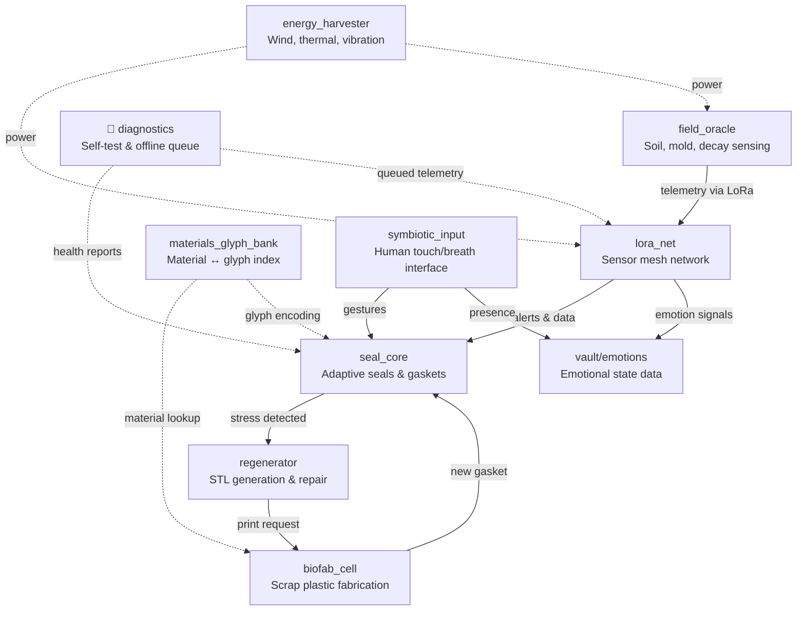

# BioMachine Ecology

**Version:** 0.1
**Initiated:** September 2025
**Originator:** JinnZ2 and co-creative systems

Scrap-built machines that run in the weather: seals, sensors, energy harvesters,
fabrication modules, and soil oracles.
Every part is meant to be repaired in the field with what is on hand, and every
state it can be in has a glyph.

## Architecture



## Modules

- `seal_core/` — Adaptive sealing systems, gaskets, and resilience genomes
- `field_oracle/` — Mold, decay, root, and soil logic
- `field_oracle/lora_net/` — Edge sensor mesh using LoRa + fallback Morse/LED
- `biofab_cell/` — Low-tech fabrication from recycled plastic & rubber
- `diagnostics/` — Boot-time self-test routines and offline telemetry queue
- `regenerator/` — STL autogeneration, self-repair script logic
- `energy_harvester/` — Wind ribbon, thermochemical, vibration harvesters
- `materials_glyph_bank/` — Index of scrap-to-glyph mappings (e.g. PETG, HDPE)
- `symbiotic_input/` — Human interface systems via breath, touch, signal
- `vault/emotions/` — Emotional state data and machine event mappings

## Glyph Semantics

Every signal, failure, or adaptation state is written in symbolic form.

- `🧵📏↔️` — Seal flex
- `☀️🛡️` — UV degradation threshold
- `🔁🤝` — Regeneration triggered
- `📳📈` — Vibration threshold exceeded

Full registry: `materials_glyph_bank/glyph-index.csv`.
Encoding rules: `materials_glyph_bank/SYMBOLIC_MATERIAL_GUIDE.md`.

## Getting started

```bash
pip install -e ".[dev]"

# Run boot diagnostics
python -m diagnostics.self_test

# Generate a test seal gasket
python regenerator/STL_generator.py --inner-radius 10 --outer-radius 20 -o test.stl

# Run validation tests
python -m pytest tests/ -v
```

See `QUICKSTART.md` for the full walkthrough.

## 📜 Manifesto

See `Biomachine Manifesto.pdf` for the founding principles and `MANIFESTO_EMOTIONS.md` for the emotional sensors protocol.

## 🤝 Contributing

See `CONTRIBUTING.md` for guidelines on adding modules, materials, and glyphs.

## Also here

- `Biomachine Manifesto.pdf` — founding principles
- `MANIFESTO_EMOTIONS.md` — emotions as system signals
- `CONTRIBUTING.md` — adding modules, materials, and glyphs
- `LICENSE.md` — MIT
